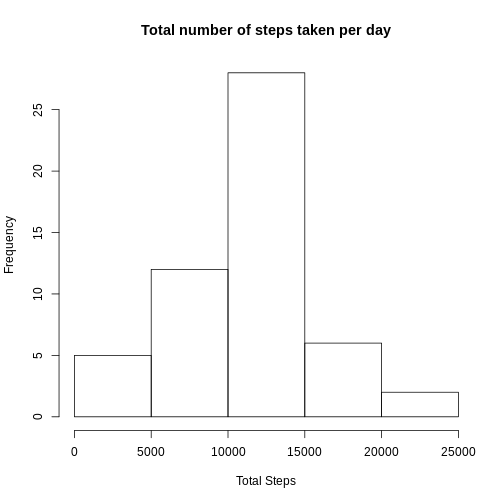
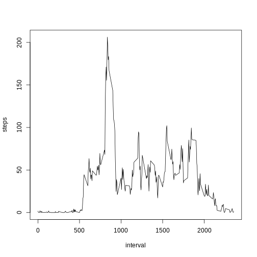
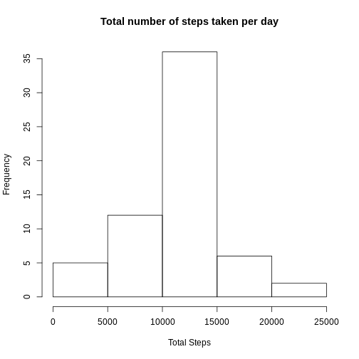
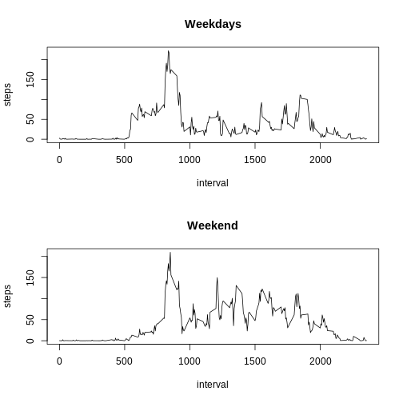

#Peer Review Assignment
Loading and preprocessing the data


```r
data.1<-read.csv("activity.csv")
data.1$date<-as.Date(data.1$date)
```

mean total number of steps taken per day


```r
total_steps<-aggregate(steps~date,data=data.1,sum,na.rm=TRUE)
#Histogram for total number of steps taken
hist(total_steps$steps,main="Total number of steps taken per day",xlab="Total Steps")
```



```r
mean(total_steps$steps)#mean
```

```
## [1] 10766.19
```

```r
median(total_steps$steps)#median
```

```
## [1] 10765
```
average daily activity pattern

```r
#Finding the average number of steps taken in a 5 mins interval
mean_steps<-aggregate(steps~interval,data=data.1,mean,na.rm=TRUE)
plot(mean_steps,type='l')
```



```r
#max mean steps
max_steps<-max(mean_steps$steps)
#matching the interval with max mean steps
max_interval<-subset(mean_steps,mean_steps$steps==max_steps)$interval
```
Imputing missing values
Using the mean of interval data to fill the missing value 

```r
#vector containing whether values are NA
s<-sapply(data.1$steps,is.na)
count<-0#counter variable
for(i in 1:length(s))
{
  if(s[i])
    count=count+1;
}
```
total number of missing values in the dataset

```r
count
```

```
## [1] 2304
```

```r
#new data set with filled in NA values
data.2<-data.1;
for(i in 1:length(s))
{
  if(s[i])
  {
      data.2$steps[i]<-subset(mean_steps,mean_steps$interval==data.1$interval[i])$steps
  }
  
}
```

mean total number of steps taken per day with missing values filled


```r
total_steps.1<-aggregate(steps~date,data=data.2,sum,na.rm=TRUE)
#Histogram for total number of steps taken
hist(total_steps.1$steps,main="Total number of steps taken per day",xlab="Total Steps")
```



```r
mean(total_steps.1$steps)#mean
```

```
## [1] 10766.19
```

```r
median(total_steps.1$steps)#median
```

```
## [1] 10766.19
```
The mean and the median are equal.
differences in activity patterns between weekdays and weekends

```r
data.2$weekd<-weekdays(data.2$date)
for(i in 1:length(data.2$weekd))
{
    if(data.2$weekd[i]=="Friday" | data.2$weekd[i]=='Saturday')
    {    data.2$weekd[i]="Weekend"
    }    
    else
    {   if(data.2$weekd[i]=="Sunday") 
            data.2$weekd[i]="Weekend"
        else
            data.2$weekd[i]="Weekdays"
    }
}
```
Comparing Weekdays and weekends trend

```r
data.2weekd<-subset(data.2,data.2$weekd=="Weekdays")
data.2weeke<-subset(data.2,data.2$weekd=="Weekend")
#Finding the average number of steps taken in a 5 mins interval
mean_steps.1<-aggregate(steps~interval,data=data.2weekd,mean,na.rm=TRUE)
mean_steps.2<-aggregate(steps~interval,data=data.2weeke,mean,na.rm=TRUE)
par(mfrow=c(2,1))
plot(mean_steps.1,type='l',main="Weekdays")
plot(mean_steps.2,type='l',main="Weekend")
```




